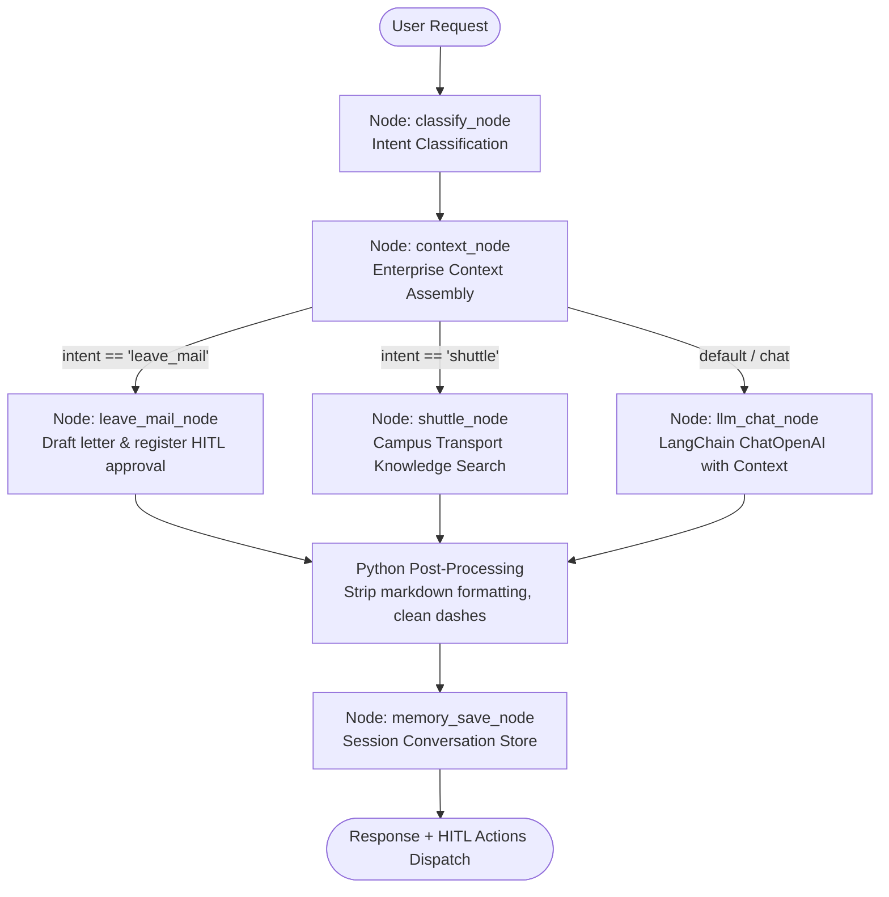
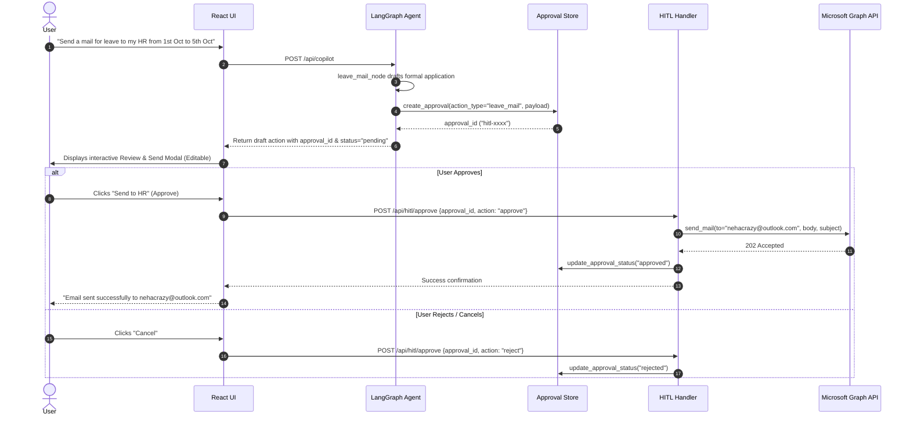

# Workday Copilot — Enterprise Agentic AI Platform

An enterprise employee workday intelligence assistant powered by **LangChain**, **LangGraph**, and **Human-in-the-Loop (HITL)** workflows, featuring Microsoft 365 Graph integration, commitment extraction, interactive meeting room booking, campus transit intelligence, and a dark cyber-themed React 19 UI.

---

## 🏛️ System Architecture

```
                                ┌──────────────────────────────────────────────┐
                                │           React 19 Frontend (UI)             │
                                │  - Voice Input / Synthesis (Web Speech API)  │
                                │  - Interactive HITL Review & Approval Modals │
                                │  - Dark Cyber Enterprise Design System       │
                                │  - Leaflet Campus Maps & Room Booking        │
                                │  - High-DPI Tech Favicon Suite & PWA Ready   │
                                └──────────────────────┬───────────────────────┘
                                                       │ HTTP / REST (JSON)
                                                       ▼
┌─────────────────────────────────────────────────────────────────────────────────────────────────────────────────┐
│                                             FastAPI Modular Backend                                             │
│                                                                                                                 │
│  ┌───────────────────────┐  ┌─────────────────────────┐  ┌────────────────────────┐  ┌───────────────────────┐  │
│  │   /api/copilot        │  │   /api/hitl/*           │  │   /api/commitments     │  │   /api/projects       │  │
│  │  (LangGraph Agent)    │  │  (Approval Store)       │  │  (Commitment Engine)   │  │  (Project Service)    │  │
│  └──────────┬────────────┘  └────────────┬────────────┘  └────────────────────────┘  └───────────────────────┘  │
│             │                            │                                                                      │
│  ┌──────────┴────────────┐  ┌────────────┴────────────┐  ┌────────────────────────┐  ┌───────────────────────┐  │
│  │   /api/mail/*         │  │   /api/calendar/*       │  │   /api/transport/*     │  │   /api/notifications  │  │
│  │  (Mailbox Proxy)      │  │  (Calendar Service)     │  │  (Shuttle & Campus)    │  │  (Notification Gen)   │  │
│  └───────────────────────┘  └─────────────────────────┘  └────────────────────────┘  └───────────────────────┘  │
│             │                            │                                                                      │
│             ▼                            ▼                                                                      │
│  ┌────────────────────────────────────────────────────┐       ┌──────────────────────────────────────────────┐  │
│  │               LangGraph State Machine              │       │          Microsoft Graph REST Proxy          │  │
│  │  - Intent Classifier Node                          │       │  - Mail, Sent Items, Drafts, Flags           │  │
│  │  - Enterprise Context Assembly Node                │◄─────►│  - Calendar Events & Importance Scores       │  │
│  │  - Leave Mail Node (HITL Trigger & Drafting)       │       │  - User Profile (/me)                        │  │
│  │  - Campus Shuttle Node (Timetable RAG)             │       └──────────────────────────────────────────────┘  │
│  │  - LLM Chat Node (LangChain ChatOpenAI)            │                                                         │
│  │  - Memory Save & Post-Processing Sanitizer         │                                                         │
│  └────────────────────────────────────────────────────┘                                                         │
└─────────────────────────────────────────────────────────────────────────────────────────────────────────────────┘
```

---

## 🌟 Core Modules & Capabilities

| Module | Description | Key Technologies |
| :--- | :--- | :--- |
| **🤖 Workday Copilot** | Conversational AI assistant aware of your calendar, unread emails, and pending commitments. Features voice input/synthesis and dynamic suggestions. | LangGraph, LangChain ChatOpenAI, Web Speech API |
| **🤝 Human-in-the-Loop (HITL)** | Secure review workflow for sensitive actions (e.g. drafting & sending leave emails to HR). Approvals are held in a pending state until user confirmed. | In-Memory Approval Store, MS Graph Mail API |
| **📬 Mail Inbox (v2)** | Full-featured email client with Inbox, Sent, Drafts, Flags, and Compose modals with Graph API synchronization. | Microsoft Graph REST API, React 19 |
| **📅 Calendar & Agenda** | Interactive schedule view, event timeline, importance scoring, and instant meeting context. | Calendar Service, Microsoft Graph Events |
| **🎯 Commitment Intelligence** | Automatically extracts promises made in outbound communications (*"I will deliver by Friday"*) to keep track of personal obligations. | Regex & NLP Commitment Extractor |
| **⏳ Waiting On** | Tracks outgoing requests and deliverables where you are waiting on responses from colleagues or external stakeholders. | Waiting Service, Heuristic Detection |
| **🏢 Meeting Rooms** | Interactive conference room browser with amenity filters (video conferencing, whiteboard, capacity) and direct reservation modal. | Static Enterprise DB, Booking Handler |
| **📊 Projects Hub** | Overview of active projects, deliverables, milestones, and quick action checklists. | Project Service, Data Store |
| **🗺️ Campus & Workplace** | Interactive campus navigation map with building details, floor plans, and facility directories. | Leaflet.js, OpenStreetMap |
| **🚌 Campus Transit** | Live shuttle schedules, route lookups, buggy tracking, and timetable Q&A. | Shuttle Transit Service, Knowledge Retrieval |
| **🌅 IST-Aware Dashboard** | Home dashboard with personalized time greetings based on Indian Standard Time (IST), agenda summary cards, and quick actions. | React Client State, Local Time Sync |

---

## 🔄 LangGraph State Machine & Chains

The core AI engine uses a compiled **LangGraph `StateGraph`** (`backend/agents/copilot_graph.py`) to process every user turn:



### LangChain Integration Details
- **Provider-Agnostic LLM Client** (`backend/core/llm.py`): LangChain's `ChatOpenAI` connects to OpenAI-compatible enterprise endpoints configured via `GENAI_BASE_URL`, `GENAI_API_KEY`, and `GENAI_MODEL`.
- **Structured Message Chains**: Prompt templates enforce strict enterprise schemas (`answer`, `actions[]`, `suggestions[]`, `context_used[]`).
- **Deterministic Fallbacks**: Integrated fallback chains for resilience when the provider is unreachable or times out.

---

## 🤝 Human-in-the-Loop (HITL) Workflow

Workday Copilot implements a strict Human-in-the-Loop pattern for critical enterprise actions (such as sending emails or applying for leave to HR).



### HITL Components
1. **Approval Store** (`backend/agents/hitl/approval_store.py`): In-memory store managing unique approval IDs, execution states (`pending`, `approved`, `rejected`, `modified`), and session mappings.
2. **Leave Node Generator** (`backend/agents/nodes/leave_mail.py`): Automatically populates HR recipient (`HR_EMAIL`), formats official dates/reasons, signs with employee details, and enqueues approval.
3. **Execution Handler** (`backend/agents/hitl/handlers.py`): Enforces that Microsoft Graph write/send calls only execute upon confirmed human approval.
4. **Interactive Modal** (`frontend/src/components/modals/Modal.jsx`): Allows the user to inspect, modify text, and approve before dispatch.

---

## 📡 API Reference

| Endpoint | Method | Description |
| :--- | :--- | :--- |
| `/api/copilot` | `POST` | Primary entry point for the LangGraph agent state machine |
| `/api/hitl/approve` | `POST` | Approve, reject, or modify a pending HITL action |
| `/api/hitl/pending/{session_id}` | `GET` | Retrieve pending HITL approvals for a session |
| `/api/context` | `POST` | Aggregated user context (profile, unread mail, today's events) |
| `/api/mail/inbox` | `GET` | Fetch user emails with search, read, and flag filters |
| `/api/mail/send` | `POST` | Direct mail dispatch via Microsoft Graph |
| `/api/calendar/events` | `GET` | Fetch calendar events for specified date range |
| `/api/calendar/importance` | `POST` | Evaluate meeting importance and compute preparation scores |
| `/api/commitments` | `GET` | Extract and list promises/commitments from user mail context |
| `/api/commitments/waiting` | `GET` | Retrieve items where the user is waiting on others |
| `/api/projects` | `GET` | List active enterprise projects, milestones, and tasks |
| `/api/transport/shuttle` | `GET` | Search campus shuttle schedules and routes |
| `/api/transport/offices` | `GET` | Campus building coordinates and amenities |
| `/api/notifications` | `GET` | Aggregate unread alerts, upcoming meetings, and reminders |

---

## 📂 Project Structure

```
genai_capstone_proj/
├── backend/
│   ├── main.py                     # FastAPI application & router registry
│   ├── requirements.txt            # Python dependencies (LangChain, LangGraph, etc.)
│   ├── core/
│   │   ├── config.py               # Environment & CORS configuration
│   │   ├── llm.py                  # LangChain ChatOpenAI client
│   │   ├── memory.py               # Session memory store
│   │   └── post_processing.py      # Python-side output sanitization
│   ├── agents/
│   │   ├── copilot_graph.py        # LangGraph StateGraph pipeline
│   │   ├── nodes/
│   │   │   ├── intent.py           # Intent classification node
│   │   │   ├── context.py          # Enterprise context assembly node
│   │   │   ├── leave_mail.py       # Leave mail agentic node (HITL)
│   │   │   ├── respond.py          # LangChain LLM generation node
│   │   │   └── action_router.py    # Routing logic
│   │   └── hitl/
│   │       ├── approval_store.py   # HITL pending approval store
│   │       └── handlers.py         # HITL decision & execution handlers
│   ├── services/
│   │   ├── graph_api.py            # Microsoft Graph REST proxy (httpx)
│   │   ├── commitment.py           # First-person commitment intelligence
│   │   ├── waiting_service.py      # Pending request tracking
│   │   ├── project_service.py      # Enterprise project management
│   │   ├── calendar_service.py     # Calendar & schedule intelligence
│   │   ├── notifications.py        # Enterprise notifications generator
│   │   ├── suggestions.py          # Dynamic suggestion engine
│   │   ├── shuttle.py              # Campus transit knowledge search
│   │   ├── static_data.py          # Enterprise mock datasets
│   │   ├── office_rag.py           # PDF-backed office RAG lookup
│   │   └── custom_embeddings.py    # Custom embedding adapter
│   ├── routers/
│   │   ├── copilot.py              # /api/copilot & /api/hitl/*
│   │   ├── context.py              # /api/context
│   │   ├── mail.py                 # /api/mail/*
│   │   ├── calendar.py             # /api/calendar/*
│   │   ├── commitments.py          # /api/commitments/*
│   │   ├── projects.py             # /api/projects/*
│   │   ├── notifications.py        # /api/notifications
│   │   └── transport.py            # /api/shuttle & /api/offices
│   └── models/
│       ├── requests.py             # Pydantic request models
│       └── responses.py            # Pydantic response models
│
└── frontend/
    ├── public/
    │   ├── favicon.svg             # High-res vector Copilot starburst favicon
    │   ├── favicon.ico             # Multi-size legacy & desktop icon
    │   ├── favicon-16x16.png       # Standard 16px raster favicon
    │   ├── favicon-32x32.png       # Standard 32px raster favicon
    │   ├── favicon.png             # 64px crisp raster icon
    │   ├── apple-touch-icon.png    # 180px iOS home screen icon
    │   ├── android-chrome-192x192.png # PWA 192px icon
    │   ├── android-chrome-512x512.png # PWA 512px splash icon
    │   └── site.webmanifest        # Web application manifest
    ├── src/
    │   ├── App.jsx                 # UI state & module orchestrator
    │   ├── main.jsx                # Application entry point
    │   ├── styles.css              # Dark cyber design system & animations
    │   ├── auth.js                 # MSAL Entra ID auth configuration
    │   ├── services/
    │   │   ├── ai.js               # API service calling backend endpoints
    │   │   └── speech.js           # Browser SpeechRecognition & SpeechSynthesis
    │   └── components/
    │       ├── layout/             # Header, Sidebar, Right pane, Notifications
    │       ├── modules/            # Copilot, Mail, Calendar, Rooms, Projects, etc.
    │       └── modals/             # HITL Modal, Login, Profile card, Splash
    ├── package.json
    └── index.html
```

---

## 🚀 Getting Started

### Prerequisites
- **Python 3.11+**
- **Node.js 18+**

### 1. Backend Setup
```powershell
cd backend
python -m venv venv
.\venv\Scripts\Activate.ps1
pip install -r requirements.txt
uvicorn main:app --reload --port 8000
```

### 2. Frontend Setup
```powershell
cd frontend
npm install
npm run dev
```
Open **http://localhost:5173** in your browser.

---

## ⚙️ Environment Variables

### Backend (`backend/.env`)
```env
GENAI_API_KEY=your_api_key
GENAI_BASE_URL=https://your-genai-endpoint/v1
GENAI_MODEL=your_model_name
LOG_LEVEL=INFO
HR_EMAIL=nehacrazy@outlook.com
```

### Frontend (`frontend/.env`)
```env
VITE_AZURE_CLIENT_ID=your_azure_client_id
VITE_AZURE_AUTHORITY=https://login.microsoftonline.com/common
VITE_REDIRECT_URI=http://localhost:5173
VITE_API_BASE_URL=http://localhost:8000
```
