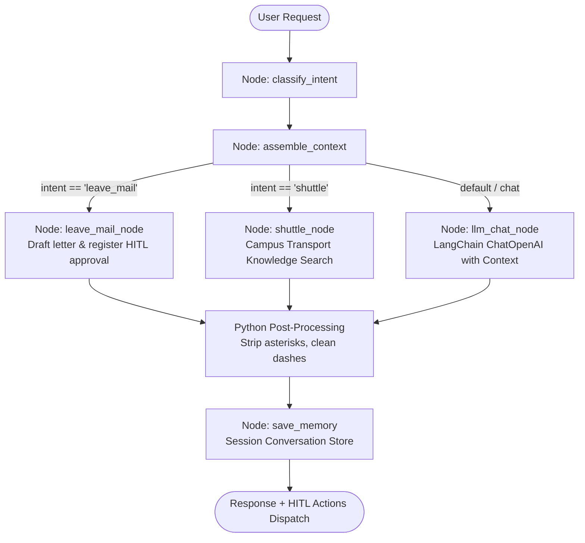
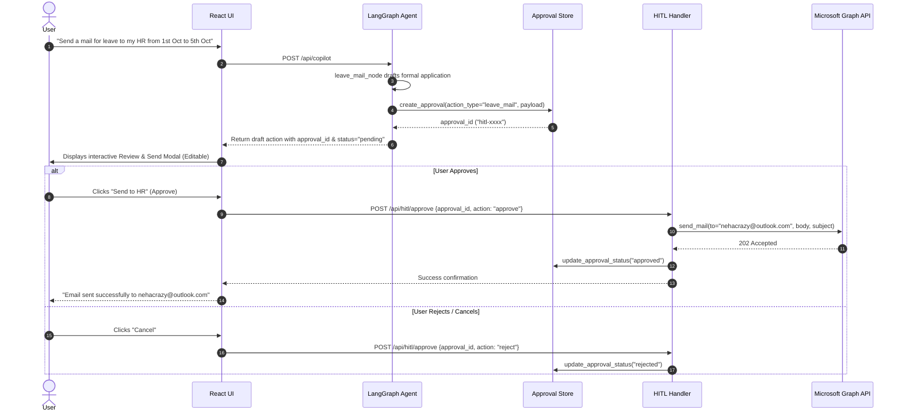

# Workday Copilot — Enterprise Agentic AI Platform

An enterprise employee workday intelligence assistant powered by **LangChain**, **LangGraph**, and **Human-in-the-Loop (HITL)** workflows, featuring Microsoft 365 Graph integration, commitment extraction, and a lightweight React UI.

---

## 🏛️ System Architecture

```
                               ┌──────────────────────────────────────────────┐
                               │           React 18 Frontend (UI Only)        │
                               │  - Voice Input / Synthesis (Web Speech API)  │
                               │  - Interactive HITL Review Modals            │
                               │  - Dark Enterprise Design System             │
                               └──────────────────────┬───────────────────────┘
                                                      │ HTTP / REST (JSON)
                                                      ▼
┌─────────────────────────────────────────────────────────────────────────────────────────────────────────────────┐
│                                             FastAPI Modular Backend                                             │
│                                                                                                                 │
│  ┌───────────────────────┐  ┌─────────────────────────┐  ┌────────────────────────┐  ┌───────────────────────┐  │
│  │   /api/copilot        │  │   /api/hitl/*           │  │   /api/commitments     │  │   /api/notifications  │  │
│  │  (LangGraph Agent)    │  │  (Approval Store)       │  │  (Commitment Engine)   │  │  (Notification Gen)   │  │
│  └──────────┬────────────┘  └────────────┬────────────┘  └────────────────────────┘  └───────────────────────┘  │
│             │                            │                                                                      │
│             ▼                            ▼                                                                      │
│  ┌────────────────────────────────────────────────────┐       ┌──────────────────────────────────────────────┐  │
│  │               LangGraph State Machine              │       │          Microsoft Graph REST Proxy          │  │
│  │  - Intent Classifier Node                          │       │  - Mail, Sent Items, Drafts, Flags           │  │
│  │  - Enterprise Context Node                         │◄─────►│  - Calendar Events & Importance              │  │
│  │  - Leave Mail Node (HITL Trigger)                  │       │  - User Profile (/me)                        │  │
│  │  - LLM Chat Node (LangChain ChatOpenAI)            │       └──────────────────────────────────────────────┘  │
│  │  - Memory Save & Post-Processing                   │                                                         │
│  └────────────────────────────────────────────────────┘                                                         │
└─────────────────────────────────────────────────────────────────────────────────────────────────────────────────┘
```

---

## 🔄 LangGraph State Machine & Chains

The core AI engine uses a compiled **LangGraph `StateGraph`** (`backend/agents/copilot_graph.py`) to process every user turn:



### LangChain Integration Details
- **Provider-Agnostic LLM Client** (`backend/core/llm.py`): LangChain's `ChatOpenAI` connects to OpenAI-compatible enterprise endpoints using `GENAI_BASE_URL`, `GENAI_API_KEY`, and `GENAI_MODEL`.
- **Structured Message Chains**: Prompt templates enforce strict enterprise schemas (`answer`, `actions[]`, `suggestions[]`, `context_used[]`).
- **Deterministic Fallbacks**: Integrated fallback chains for resilience when the provider is unreachable.

---

## 🤝 Human-in-the-Loop (HITL) Workflow

Workday Copilot implements a strict Human-in-the-Loop pattern for critical enterprise actions (such as sending emails or applying for leave to HR).



### HITL Components
1. **Approval Store** (`backend/agents/hitl/approval_store.py`): In-memory store managing unique approval IDs, execution states (`pending`, `approved`, `rejected`, `modified`), and session mappings.
2. **Leave Node Generator** (`backend/agents/nodes/leave_mail.py`): Automatically populates HR recipient (`nehacrazy@outlook.com`), formats official dates/reasons, signs with employee details, and enqueues approval.
3. **Execution Handler** (`backend/agents/hitl/handlers.py`): Enforces that Microsoft Graph write/send calls only execute upon confirmed human approval.
4. **Interactive Modal** (`frontend/src/components/modals/Modal.jsx`): Allows the user to inspect, modify text, and approve before dispatch.

---

## 📂 Project Structure

```
genai_capstone_proj/
├── backend/
│   ├── main.py                     # FastAPI application & router registry
│   ├── requirements.txt            # Python dependencies (LangChain, LangGraph, etc.)
│   ├── core/
│   │   ├── config.py               # Environment & CORS configuration
│   │   ├── llm.py                  # LangChain ChatOpenAI client
│   │   ├── memory.py               # Session memory store
│   │   └── post_processing.py      # Python-side output sanitization
│   ├── agents/
│   │   ├── copilot_graph.py        # LangGraph StateGraph pipeline
│   │   ├── nodes/
│   │   │   ├── intent.py           # Intent classification node
│   │   │   ├── context.py          # Enterprise context assembly node
│   │   │   ├── leave_mail.py       # Leave mail agentic node (HITL)
│   │   │   ├── respond.py          # LangChain LLM generation node
│   │   │   └── action_router.py    # Routing logic
│   │   └── hitl/
│   │       ├── approval_store.py   # HITL pending approval store
│   │       └── handlers.py         # HITL decision & execution handlers
│   ├── services/
│   │   ├── graph_api.py            # Microsoft Graph REST proxy (httpx)
│   │   ├── commitment.py           # First-person commitment intelligence
│   │   ├── notifications.py        # Enterprise notifications generator
│   │   ├── suggestions.py          # Dynamic suggestion engine
│   │   ├── shuttle.py              # Campus transit knowledge search
│   │   ├── static_data.py          # Enterprise mock datasets
│   │   ├── office_rag.py           # PDF-backed office RAG lookup
│   │   └── custom_embeddings.py    # Custom embedding adapter
│   ├── routers/
│   │   ├── copilot.py              # /api/copilot & /api/hitl/*
│   │   ├── context.py              # /api/context
│   │   ├── mail.py                 # /api/mail/*
│   │   ├── calendar.py             # /api/calendar/*
│   │   ├── commitments.py          # /api/commitments/*
│   │   ├── notifications.py        # /api/notifications
│   │   └── transport.py            # /api/shuttle & /api/offices
│   └── models/
│       ├── requests.py             # Pydantic request models
│       └── responses.py            # Pydantic response models
│
└── frontend/
    ├── src/
    │   ├── App.jsx                 # Lightweight UI state & layout orchestrator
    │   ├── main.jsx                # Application entry point
    │   ├── styles.css              # Dark mode styling & animations
    │   ├── auth.js                 # MSAL Entra ID auth configuration
    │   ├── services/
    │   │   ├── ai.js               # API service calling backend endpoints
    │   │   └── speech.js           # Browser SpeechRecognition & SpeechSynthesis
    │   └── components/
    │       ├── layout/             # Header, Sidebar, Right pane, Notifications
    │       ├── modules/            # Copilot, Mail, Calendar, Commitments, etc.
    │       └── modals/             # HITL Modal, Login, Profile card, Splash
    ├── package.json
    └── index.html
```

---

## 🚀 Getting Started

### Prerequisites
- Python 3.11+
- Node.js 18+

### 1. Backend Setup
```powershell
cd backend
python -m venv venv
.\venv\Scripts\Activate.ps1
pip install -r requirements.txt
uvicorn main:app --reload --port 8000
```

### 2. Frontend Setup
```powershell
cd frontend
npm install
npm run dev
```
Open **http://localhost:5173** in your browser.

---

## ⚙️ Environment Variables

### Backend (`backend/.env`)
```env
GENAI_API_KEY=your_api_key
GENAI_BASE_URL=https://your-genai-endpoint/v1
GENAI_MODEL=your_model_name
LOG_LEVEL=INFO
HR_EMAIL=nehacrazy@outlook.com
```

### Frontend (`frontend/.env`)
```env
VITE_AZURE_CLIENT_ID=your_azure_client_id
VITE_AZURE_AUTHORITY=https://login.microsoftonline.com/common
VITE_REDIRECT_URI=http://localhost:5173
VITE_API_BASE_URL=http://localhost:8000
```
